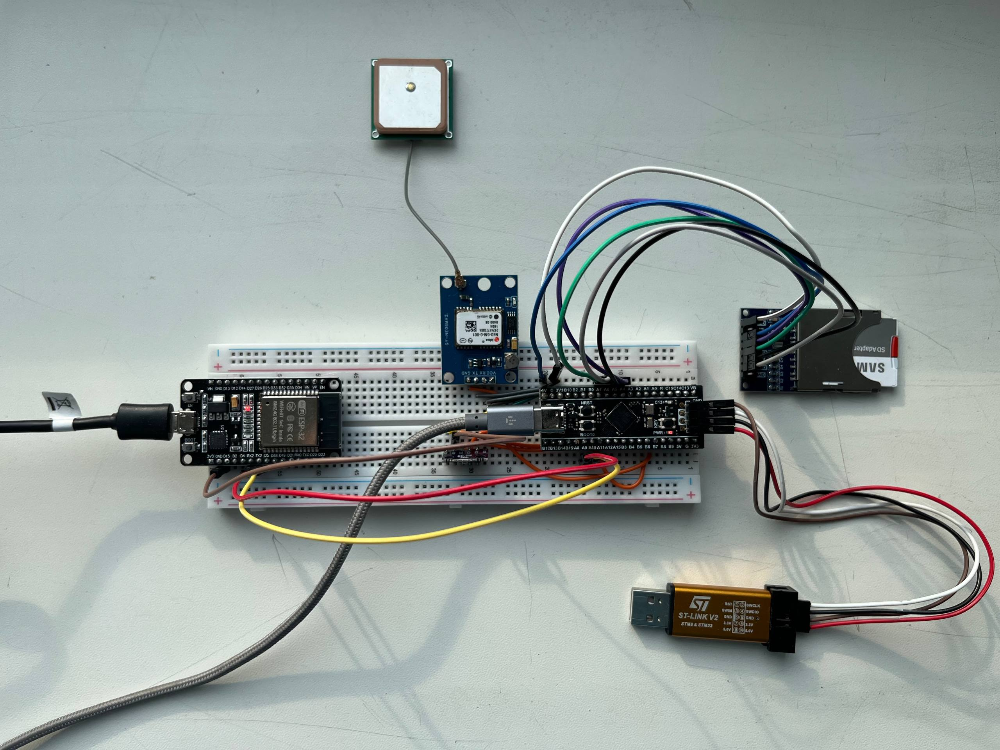
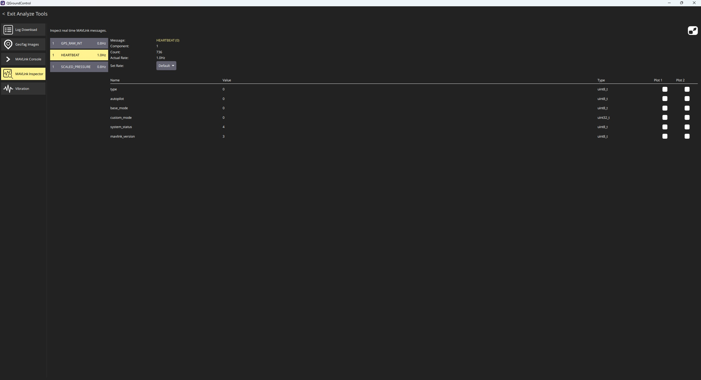

# UAV Black Box & Telemetry System


*Bench test rig: STM32F411 (Black Pill) + ESP32 Wi-Fi bridge, NEO-6M GPS, SD card logging, ST-Link programmer*

A flight recorder and live telemetry link for small UAVs, built from scratch in C++/FreeRTOS on bare-metal STM32. It logs barometric and GPS data to an SD card for post-flight analysis, and simultaneously streams live MAVLink telemetry over a UART→Wi-Fi bridge into **QGroundControl**, using the same MAVLink dialect that drives real autopilot stacks (PX4/ArduPilot).

Built as a hardware/firmware systems project: real sensors, real RTOS scheduling, real serial protocols — with an architecture disciplined enough to unit-test the entire sensor/logging/telemetry pipeline on a host machine, without any hardware attached.

## Tech Stack

C++17 · FreeRTOS · STM32 HAL · FatFS · MAVLink v2 · I2C / UART / SPI · GoogleTest/GoogleMock · CMake · ESP32 (Arduino) · Wi-Fi/UDP

## Data Flow

```
BMP280 ──I2C1──┐                       ┌──► SensorTask ──┐
               │                       │  getDataString()│
NEO-6M ──UART2─┴── shared sensor ──────┤                 ▼
      (IRQ-fed       objects           │        FreeRTOS Queue
       NMEA)                           │                 │
                                       │                 ▼
                                       │            LoggerTask (LoggerStrategy)
                                       │             ╱              ╲
                                       │     FatFSLogger        UsbCdcLogger
                                       │   (SD card, SPI)     (USB CDC mirror)
                                       │
                                       └──► MavLinkTask ── getReading() ──► MavLinkPacketBuilder
                                                                                       │
                                                                              UART1 TX, 115200 baud
                                                                                       ▼
                                                                            ESP32 (dumb byte forwarder)
                                                                               Wi-Fi AP + UDP:14550
                                                                                       ▼
                                                                              QGroundControl (downlink)
```

Note: the ESP32 sketch also forwards `UDP → UART1 RX` for a future command uplink, but the STM32 firmware doesn't act on UART1 RX today — `HAL_UART_RxCpltCallback` only handles `USART2` (GPS). The live link is currently telemetry-out only.

- **Barometer (BMP280, I2C1)** and **GPS (NEO-6M, UART2, 9600 baud)** are each polled by a dedicated FreeRTOS `SensorTask`. GPS parsing is fully interrupt-driven: `HAL_UART_RxCpltCallback` feeds NMEA bytes into `Gps::handleRxInterrupt()` one at a time, with sentence-buffer overflow protection — no blocking reads on the flight path.
- Every sensor reading is pushed as a fixed-size `LogMessage` onto a FreeRTOS message queue. Sensors and the logger **never call each other directly** — the queue is the only coupling, which keeps sensor polling jitter-free even if a log write stalls.
- A `LoggerTask` drains the queue and fans each entry out to **two destinations at once** (`LoggerStrategy`): the SD card via **FatFS over SPI**, and a **USB CDC virtual serial port**, so the log stream can be watched live on a PC during bench testing without pulling the SD card.
- A separate `MavLinkTask` builds MAVLink v2 packets (`HEARTBEAT`, `SCALED_PRESSURE`, `GPS_RAW_INT`) from the same live sensor objects and pushes them out **UART1 at 115200 baud**.
- An **ESP32** (`UdpMavLinkTransmitter/esp32_mavlink_bridge`) sits on the other end of UART1 as a dumb byte-forwarder: it hosts a Wi-Fi access point and relays the MAVLink stream over **UDP port 14550** — QGroundControl's standard auto-connect port — broadcasting until a ground station is heard from, then switching to unicast. Uplink (QGC → vehicle) is forwarded back over the same UART. The STM32 never touches Wi-Fi or IP directly; it only ever speaks bytes over UART, which keeps the flight firmware free of networking complexity and lets the radio link be swapped independently.

**Result:** open QGroundControl on a laptop, connect to the ESP32's AP, and see live position/altitude telemetry — while every reading is durably logged to SD in parallel, so a flight is both recoverable after the fact and observable in real time.

*QGroundControl's MAVLink Inspector confirming a live, sustained link: HEARTBEAT at 1 Hz with 736 messages received, component ID 1 (`MAV_COMP_ID_AUTOPILOT1`) recognized correctly, alongside GPS_RAW_INT and SCALED_PRESSURE streaming from the same session.*

## Hardware

| Component | Role | Interface |
|---|---|---|
| WeAct STM32F411CEU6 ("Black Pill", ARM Cortex-M4, 100 MHz) | Main flight controller / recorder MCU | — |
| BMP280 | Barometric pressure & altitude | I2C1 |
| NEO-6M | GPS position/velocity fix (NMEA) | UART2 @ 9600 |
| microSD card | Persistent flight log storage | SPI + FatFS |
| ESP32 DevKit | UART↔Wi-Fi/UDP MAVLink bridge to GCS | UART1 @ 115200 |
| USB (CDC) | Live log mirror / bench debugging | USB FS |

Peripheral configuration is managed through CubeMX (`UAV_BlackBox.ioc`); all hand-written application logic lives outside the generated code, in `Core/App`.

## Software Design

The codebase is deliberately layered so the application logic is testable on a host machine, independent of the STM32 toolchain and any physical hardware:

- **`Sensor/`** — an `ISensor` interface (`init`, `update`, `getDataString`, `getName`, `getDelay`) implemented by `Barometer` and `Gps`. Each sensor receives its bus dependency through constructor injection rather than reaching for a global HAL handle, so it can be instantiated against a real or fake bus interchangeably.
- **`HardwareInterface/`** — abstract bus interfaces (`II2CBus`, `IUartBus`, `IFatFS`), each with two implementations: an `Stm32*` adapter that wraps real HAL calls, and a mock used in unit tests. This is the seam that makes everything above it hardware-independent.
- **`Logger/`** — an `ILogger` interface implemented by `FatFSLogger` (SD card), `UsbCdcLogger`, and `UartLogger`, composed behind a `LoggerStrategy` that fans writes out to multiple sinks behind a single interface.
- **`Service/`** — `MavLinkPacketBuilder` translates internal sensor readings into MAVLink v2 wire packets (heartbeat, scaled pressure, GPS raw int), decoupling telemetry framing from both the sensors and the transport.
- **`Watchdog/`** — `TaskLiveness` is a plain, hardware-agnostic scoreboard: each supervised task reports a "still alive" timestamp once per loop iteration, and it can be asked whether every tracked task has checked in recently. It has no knowledge of FreeRTOS or the IWDG, which keeps it host-testable like the rest of `Core/App`.
- **`app_main.cpp`** — the composition root: wires concrete sensors/buses/loggers together and defines the FreeRTOS tasks (`SensorTask` per sensor, `LoggerTask`, `MavLinkTask`, `WatchdogTask`), communicating exclusively through a message queue.

This dependency-inversion style (interfaces + constructor injection at every hardware boundary) is what makes the next section possible.

## Reliability

The device is meant to keep recording no matter what, so it's backstopped by the STM32's independent hardware watchdog (IWDG) — a countdown timer on its own internal oscillator, separate from the main system clock, that force-resets the chip if it's never refreshed in time. It's configured for a ~4 second timeout (prescaler 64, reload 1999) and starts counting from very early in `main()`, before the RTOS scheduler even starts.

Rather than refreshing it blindly from a timer (which would only prove the scheduler is running, not that any actual work is happening), a dedicated `WatchdogTask` only calls `HAL_IWDG_Refresh()` once every task it supervises — both `SensorTask`s, `LoggerTask`, and `MavLinkTask` — has reported liveness within the last 4 seconds via `TaskLiveness`. If any single task hangs (a stuck I2C read, a wedged UART), that task simply stops checking in, the watchdog task withholds the refresh, and the IWDG force-resets the whole board rather than leaving it silently frozen for the rest of the flight. On the next boot, `app_main_task` checks the `RCC_FLAG_IWDGRST` reset-cause flag and logs it, so a watchdog-triggered reset during a flight is visible after the fact instead of just showing up as a gap in the log.

## Testing

The application layer (`Core/App`) is unit-tested on the host with **GoogleTest/GoogleMock** — 55+ test cases covering GPS NMEA parsing (including malformed/edge-case sentences and buffer-overflow protection), barometer calibration/read logic, SD-card logging failure paths, and MAVLink packet encoding/decoding — via a CMake/Ninja project fully decoupled from the ARM toolchain:

```
cmake -S tests -B tests/build -G Ninja
cmake --build tests/build
tests/build/unit_tests.exe
```

Every hardware dependency (I2C bus, UART bus, FatFS) is swapped for a mock in these tests, so sensor logic, log-writing logic, and packet encoding are all verified without a board on the bench — catching regressions in parsing/protocol logic long before flight testing.

## Build Systems

This repo has two independent build systems:

1. **Firmware** (`Core/`, `Drivers/`, `FATFS/`, `USB_DEVICE/`, `Middlewares/`) — an STM32CubeIDE project targeting the STM32F411 (arm-none-eabi toolchain). Build via STM32CubeIDE, or `make -C Debug` if the ARM toolchain is on `PATH`.
2. **Unit tests** (`tests/`) — a host-native CMake/Ninja project (GoogleTest/GoogleMock), see [Testing](#testing) above.

The ESP32 bridge sketch (`UdpMavLinkTransmitter/esp32_mavlink_bridge`) is a standalone Arduino project flashed separately onto the ESP32.
